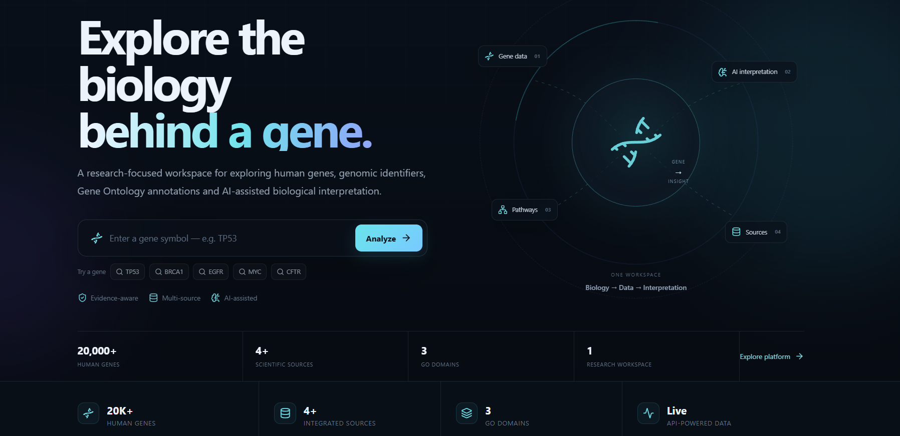
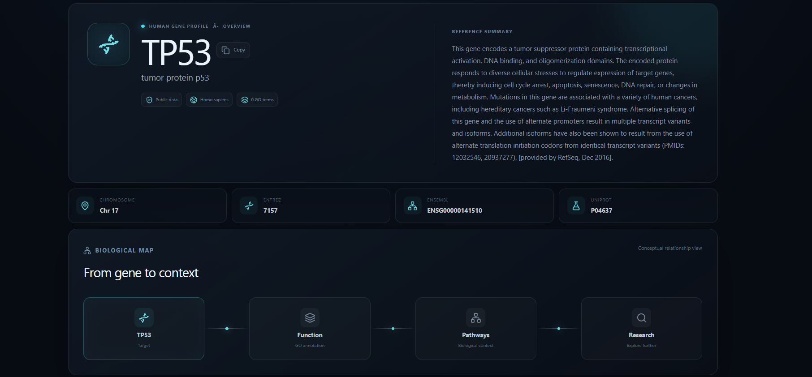
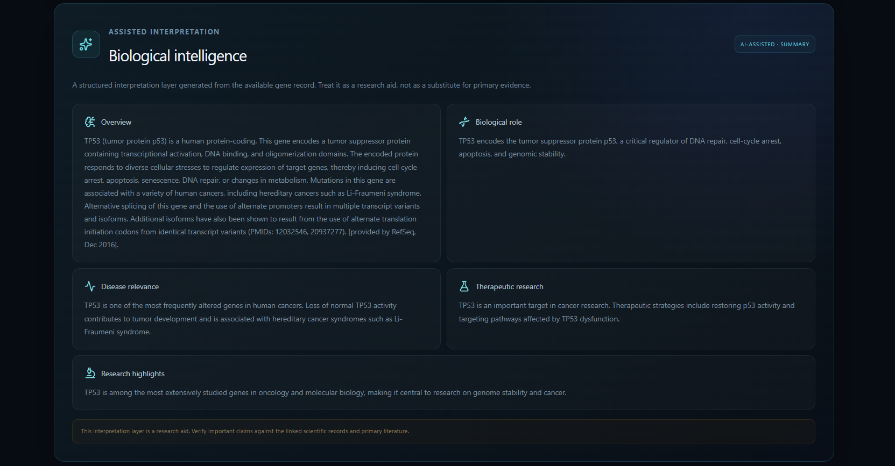

# 🧬 Gene Insight Explorer

[](https://github.com/aryansingh200600thakur-dot/Gene-Insight-Explorer)
[](https://react.dev/)
[](https://fastapi.tiangolo.com/)
[](#)
[](#)

### 🌐 Live Demo

**[Launch Gene Insight Explorer →](https://gene-insight-explorer.vercel.app/)**

> **Explore genes. Connect biological knowledge. Discover insights.**

Gene Insight Explorer is an interactive computational biology platform designed to bring together gene-level information from multiple biological databases in a single interface.

The project combines **bioinformatics APIs, genomic data, modern web technologies, and AI-assisted analysis** to make biological information easier to explore and understand.

---

## 🖥️ Platform Preview

<p align="center">
  
</p>

<p align="center">
  <em>Research-focused workspace for exploring human genes, genomic identifiers, biological annotations, and AI-assisted interpretation.</em>
</p>

---

## 🔬 Why Gene Insight Explorer?

Biological information about a single gene is often distributed across multiple databases.

Gene Insight Explorer brings these sources together into one workflow:

```text
Gene Symbol
     ↓
Gene Information
     ↓
Biological Annotations
     ↓
Cross-Database Integration
     ↓
AI-Assisted Analysis
     ↓
Interactive Exploration
```

---

## ✨ Features

- 🔎 Search genes using gene symbols
- 🧬 Retrieve gene-level biological information
- 📊 Interactive presentation of genomic data
- 🔬 Gene Ontology information
- 🤖 AI-assisted gene analysis
- 🌐 Integration with biological databases
- ⚡ Modern responsive interface
- 🔗 REST API-based architecture
- 🧩 Modular frontend and backend structure

---

## 🔬 Gene Profile

The gene profile view brings together key identifiers and biological context from integrated data sources.

<p align="center">
  
</p>

---

## 🤖 AI-Assisted Biological Intelligence

Gene Insight Explorer includes an AI-assisted interpretation layer that organizes available gene information into a structured research-oriented summary.

<p align="center">
  
</p>

> **Research note:** AI-generated interpretation should be treated as an exploratory research aid and verified against primary scientific sources.

---

## 🗃️ Data Sources

Gene Insight Explorer integrates information from several established biological resources.

| Resource | Purpose |
|---|---|
| **MyGene.info** | Gene and genomic information |
| **QuickGO** | Gene Ontology annotations |
| **NCBI** | Biological and genomic resources |
| **Ensembl** | Genome and gene information |
| **UniProt** | Protein and functional information |

> Data availability may vary between genes and external database APIs.

---

## 🏗️ Architecture

```text
                         USER
                           │
                           ▼
                ┌─────────────────────┐
                │   React Frontend     │
                │ TypeScript + Vite    │
                └──────────┬──────────┘
                           │
                           │ REST API
                           ▼
                ┌─────────────────────┐
                │   FastAPI Backend    │
                │       Python         │
                └──────────┬──────────┘
                           │
             ┌─────────────┼─────────────┐
             │             │             │
             ▼             ▼             ▼
        MyGene.info      QuickGO        NCBI
             │             │             │
             └─────────────┼─────────────┘
                           │
                    ┌──────┴──────┐
                    │             │
                    ▼             ▼
                 Ensembl       UniProt
                    │             │
                    └──────┬──────┘
                           ▼
                 Gene Intelligence
                           │
                           ▼
                    AI-Assisted
                      Analysis
```

---

## 🛠️ Technology Stack

### Frontend

- React
- TypeScript
- Vite
- Tailwind CSS
- Framer Motion
- Chart.js
- Cytoscape

### Backend

- Python
- FastAPI
- Pydantic
- REST APIs

### Biological Data

- MyGene.info
- QuickGO
- NCBI
- Ensembl
- UniProt

### Development

- Git
- GitHub
- VS Code

---

## 🚀 Getting Started

### Prerequisites

Make sure you have:

- Node.js
- npm
- Python 3.13+
- Git

### Clone the repository

```bash
git clone https://github.com/aryansingh200600thakur-dot/Gene-Insight-Explorer.git

cd Gene-Insight-Explorer
```

---

## 💻 Frontend Setup

Navigate to the frontend:

```bash
cd frontend
```

Install dependencies:

```bash
npm install
```

Start the development server:

```bash
npm run dev
```

---

## 🐍 Backend Setup

Navigate to the backend:

```bash
cd backend
```

Create a virtual environment:

```bash
python -m venv venv
```

Activate it on Windows:

```bash
venv\Scripts\activate
```

Install dependencies:

```bash
pip install -r requirements.txt
```

Start the API:

```bash
uvicorn app.main:app --reload
```

---

## 🔎 Example Genes

Try searching for genes such as:

```text
TP53
BRCA1
EGFR
```

---

## 📡 API Architecture

The backend acts as an integration layer between the frontend and external biological resources.

```text
Frontend
   │
   ▼
FastAPI
   │
   ├── Gene Services
   ├── Biological Annotations
   ├── External API Clients
   └── AI Analysis
           │
           ▼
      Biological APIs
```

This separation helps keep external API communication and application logic organized independently from the user interface.

---

## 🧠 AI-Assisted Analysis

The AI component is designed to provide additional interpretation of gene-level information and organize biological information into a more accessible research-oriented format.

The AI functionality is intended as an **exploratory research-assistance feature**, not as a replacement for experimental validation or professional biomedical interpretation.

---

## 📈 Roadmap

### Completed

- [x] Gene search
- [x] Biological database integration
- [x] Gene Ontology integration
- [x] AI-assisted analysis
- [x] Interactive frontend
- [x] FastAPI backend

### Future Development

- [ ] Advanced gene comparison
- [ ] Improved biological visualization
- [ ] Expanded pathway analysis
- [ ] Network-based gene exploration
- [ ] Additional biological databases
- [ ] More advanced AI-assisted research workflows
- [ ] Automated testing and CI/CD

---

## 🔬 Scientific Scope

Gene Insight Explorer is a research and educational software project exploring the intersection of:

**Genomics · Bioinformatics · Computational Biology · Artificial Intelligence**

The project demonstrates how software engineering can be applied to biological data exploration and research workflows.

---

## ⚠️ Disclaimer

Gene Insight Explorer is a research and educational software project.

Information retrieved from external biological databases may change over time and should be verified against the original data sources before being used in scientific research or clinical decision-making.

---

## 👨‍💻 Author

### Aryan Singh

**Biotechnology · Genetic Engineering · Computational Biology · AI**

Building software and research projects at the intersection of biology and technology.

---

## 📄 License

This project is currently under development.

License information will be added as the project evolves.

---

<p align="center">
  <strong>🧬 Biology × 💻 Technology × 🤖 AI</strong>
</p>
